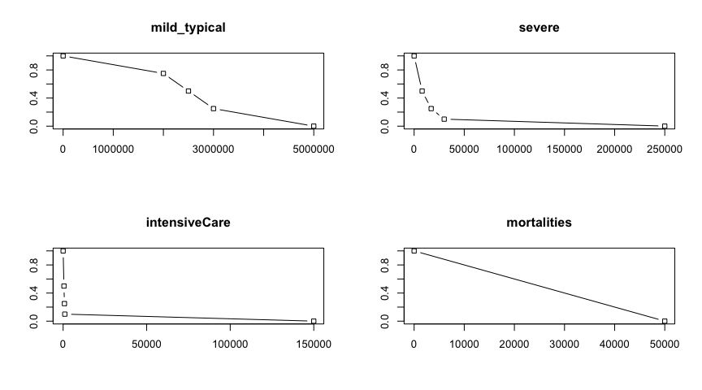
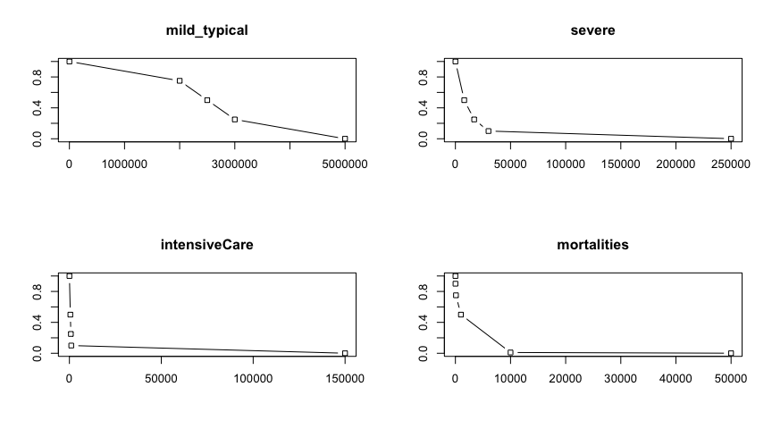

<!-- # Setup -->

<!-- # Load and manipulate the data: performance table, value functions, weights for each scenario -->

# Simulation data exploration
## Performance of the Strategy 0 ("do-nothing") on the attributes related to the "Minimise negative health impact" objective, Scenarios 1-5 (excl. 4)
<!--html_preserve-->

<!--/html_preserve--><!--html_preserve-->

<!--/html_preserve--><!--html_preserve-->

<!--/html_preserve--><!--html_preserve-->

<!--/html_preserve-->
Scenario 4 is way off. Turned out it was incorrectly configured. It's temporarily excluded from further analysis.

<!-- Notably, the strategy 6 under scenario 1 has higher utility than Strategy 7 (mild_typical and severe), strategy 3 is higher than stratgy 4 (mild_typical) -->

## Transform performance of alternatives into utilities using value functions
<!-- -->

<!-- ## Defining FUNCTIONS -->

<!-- ## Strategies' Radar Performance values for 5 scenarios (excl. scenario 4) -->

## Health utilities for Scenarios 1-5 (excl. 4) (original value functions)
<!--html_preserve-->

<!--/html_preserve--><!--html_preserve-->

<!--/html_preserve--><!--html_preserve-->

<!--/html_preserve--><!--html_preserve-->

<!--/html_preserve-->
Performance of the 7 alternative strategies with respect to the "Minimise number of severe cases" and "Minimise number of people in need of intensive care"  attributes are very close, specifically under Scenario 2,3, 5. Notably, utilities of the Strategies 0-5 for "# of severe cases"" and "# ICU" are about the same under Scenario 3 -- due to similar shapes and disticnt points of the respective value functions (mind the bisection method).

## Modified value function for mortalities
Value function of mortality seems to be impractical as its zero value corresponds to 50 000 cases. "50 000 mortalities" assumes Scenario 5 (the most lethal) and Strategy 0 (do nothing), which sets the lowest possible "bar" for performance. Another connected issue is that the value function is linear, meaning that low number of deaths relative to 50 000 (e.g. 16 under scenario 2) gives a minuscule penalty to the utility as it evaluate performance proportionally (1- 16/50 000).

The shape of a value function could be dependant on a scenario. Indeed, with a mild scenario we should not expect more than 100 mortalities whereas with a catastrophic scenario 5 more than 10 000 is a real possibility. However, at the time of decision regariding the intervention strategy it is uknown which scenario is to unfold. Therefore, the shape of the "Mortalities value function"" could be modified to reflect "worst-cases" for each scenario (as estimated by the simulation model).
<!-- -->

## Health-related utilities with modified value function for # of mortalities, for Scenarios 1-5 (excl. 4)

<!--html_preserve-->

<!--/html_preserve--><!--html_preserve-->

<!--/html_preserve--><!--html_preserve-->

<!--/html_preserve--><!-- --><!-- --><!--html_preserve-->

<!--/html_preserve-->

## Aggregated utilties (weighted sum) for scenario 1-5 (excl. 4) with modified value function for mortality
<!--html_preserve-->

<!--/html_preserve--><!--html_preserve-->

<!--/html_preserve--><!--html_preserve-->

<!--/html_preserve--><!--html_preserve-->

<!--/html_preserve-->

<!-- ## Aggregatd Utility per Strategy per Scenario: HEALTH related attributes ONLY -->

<!--html_preserve-->

<!--/html_preserve-->

## Ranking alternatives by the HEALTH related attributes
<!--html_preserve-->

<!--/html_preserve-->

## Comparing aggregated utilities and ranks for MOD and ORIG vf for mortalities

<!--html_preserve-->

<!--/html_preserve-->

<!--html_preserve-->

<!--/html_preserve-->

<!--html_preserve-->

<!--/html_preserve-->

# Costs
## Exploring the costs
<!--html_preserve-->

<!--/html_preserve--><!--html_preserve-->

<!--/html_preserve--><!--html_preserve-->

<!--/html_preserve--><!--html_preserve-->

<!--/html_preserve-->

<!-- ## Normalising costs -->

# exploring costs_health_weighted_aggregate
## costs VS health weights sensitivity analysis
<!--html_preserve-->

<!--/html_preserve-->
The simple approach is to investigate at what weights the rank for each alternative changes.
<!-- At the current decision goals is it  more meanignful to conduct a cost-benefit analysis? -->
<!--html_preserve-->

<!--/html_preserve--><!--html_preserve-->

<!--/html_preserve--><!--html_preserve-->

<!--/html_preserve--><!--html_preserve-->

<!--/html_preserve-->

# Exploring robustness of strategies at different scenarios

<!--html_preserve-->

<!--/html_preserve--><!--html_preserve-->

<!--/html_preserve-->

# Investigate causal/preferential dependance of costs and health impact

TODO Plot box-plot for aggregated scores to see variance among scenarios
